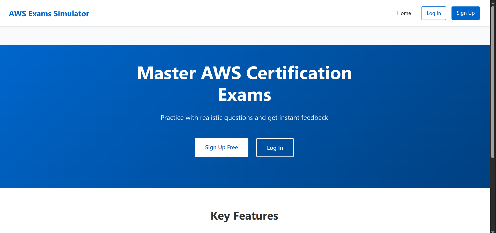

# AWS Exams Simulator

## Overview

AWS Exams Simulator is a web application designed to help users prepare for AWS certification exams. The application provides a realistic exam experience with a collection of practice questions covering various AWS services and concepts.

<p align="center">  </p>

## Features

- **Practice Exams**: Multiple practice exams covering different AWS domains
- **Realistic Interface**: Clean, distraction-free exam environment
- **Instant Feedback**: Immediate feedback on answers with detailed explanations
- **Progress Tracking**: Track your performance across different exam attempts
- **Responsive Design**: Works on desktop and mobile devices

## Getting Started

### Prerequisites

- Node.js (v14 or higher)
- npm or yarn

### Installation

1. Clone the repository

   ```
   git clone https://github.com/yourusername/aws-exams-simulator.git
   cd aws-exams-simulator
   ```

2. Install dependencies

   ```
   npm install
   ```

3. Start the development server

   ```
   npm run dev
   ```

4. Open your browser and navigate to `http://localhost:5173`

## Usage

1. Log in or create an account
2. Select an exam from the dashboard
3. Answer the questions at your own pace
4. Review your results and explanations
5. Track your progress over time

## Technologies Used

- React
- Styled Components
- Vite
- React Router

## License

MIT
